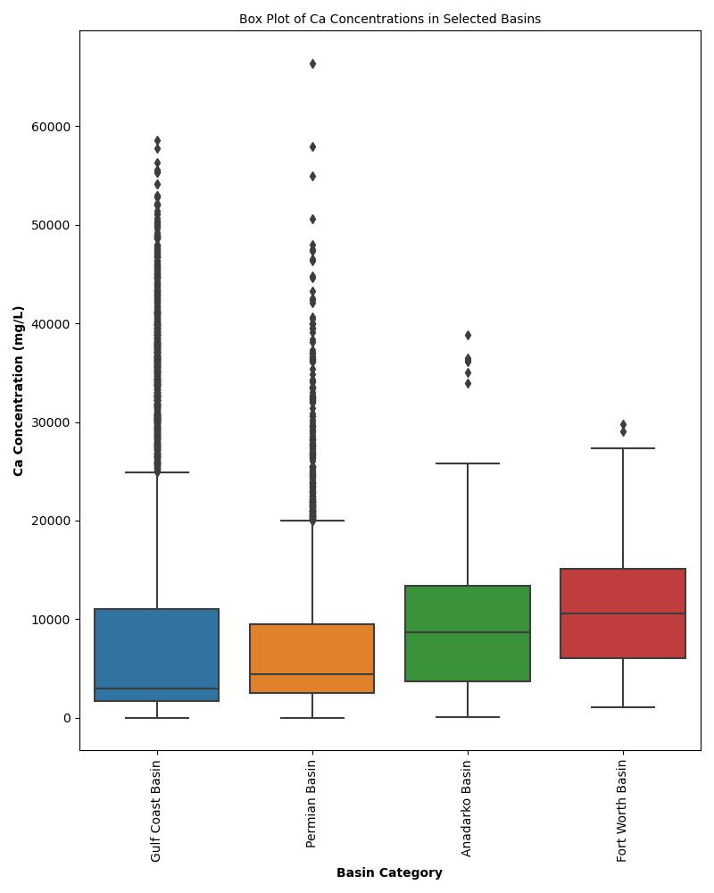
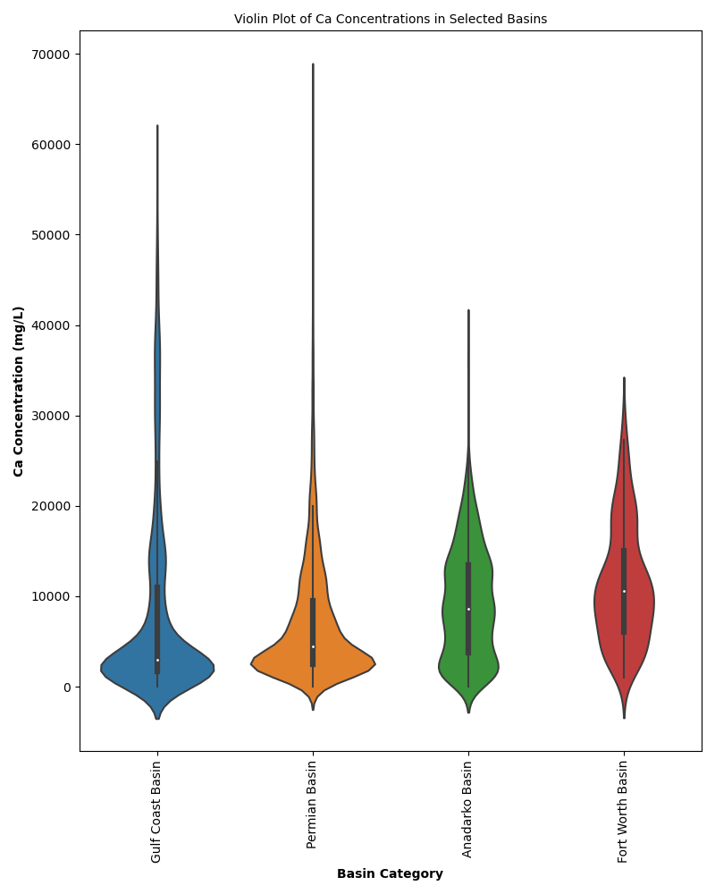
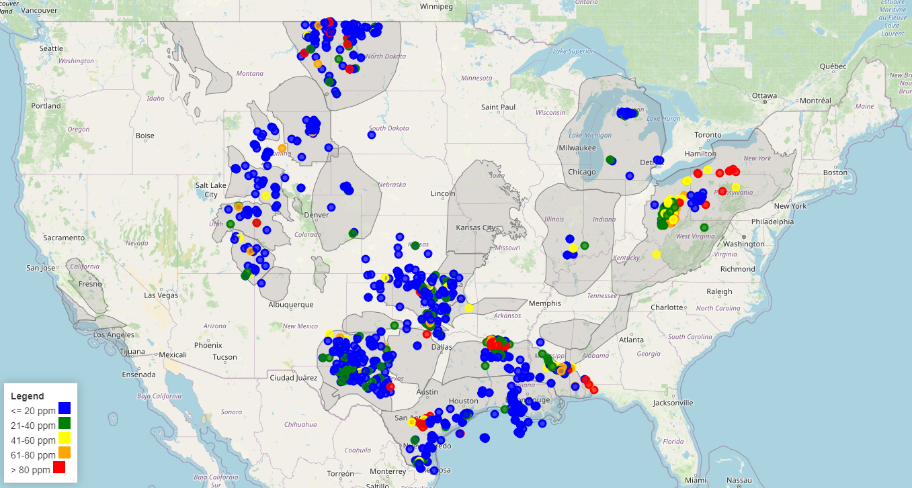
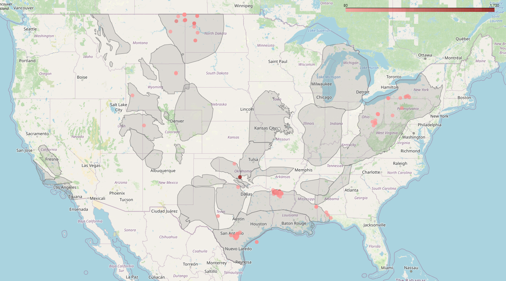
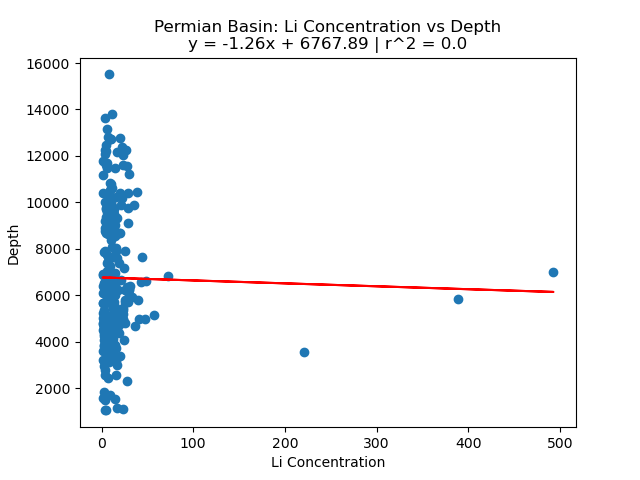

# Analysis & Visualization of Produced Water Chemistry for Environmental & Agricultural Utilization  

## 
Abstract:
 

Produced water, a byproduct of oil and gas extraction, poses environmental challenges due to its complex chemical composition and high salinity. This project focuses on two key objectives: analyzing the chemistry of produced water with a focus on scaling elements and evaluating the availability of lithium for potential extraction. Utilizing data from the United States Geological Survey (USGS), a comprehensive methodology for data cleaning and filtering is employed to ensure accuracy.

The analysis encompasses key elements such as Sodium, Calcium, Chloride, Sulfate, and Magnesium, with a focus on Total Dissolved Solids (TDS) greater than 35,000 ppm. Applying natural chemical balance conditions refines the dataset, and stringent charge balance criteria are employed for reliability. Missing data are addressed with tailored strategies respecting chemical properties.

Visualizations include box and violin plots showcasing elemental concentrations across geological basins, Piper plots for water type classification, and interactive maps revealing scaling element and lithium concentration clusters. The methodology ensures a clear representation of scaling element and lithium distribution and facilitates insights into spatial patterns. Furthermore, the project introduces a linear regression analysis on lithium concentration versus depth to investigate whether a relationship is present.  

In conclusion, this research provides a nuanced understanding of produced water chemistry, supports sustainable water management, aligns with DOE goals, and explores the potential for resource recovery. The methodologies presented are adaptable, promoting transparency and fostering environmentally responsible practices in the oil and gas industry.

## 
Table of Contents:
 

[1. Introduction](#1-introduction)  
&nbsp;&nbsp;&nbsp;&nbsp;[1.1 Overview of Produced Water](#11-overview-of-produced-water)    
&nbsp;&nbsp;&nbsp;&nbsp;[1.2 Objectives](#11-overview-of-produced-water)  
[2. Data Acquisition & Initial Processing](#2-data-acquisition--initial-processing)  
&nbsp;&nbsp;&nbsp;&nbsp;[2.1 Raw Data Acquisition](#21-raw-data-acquisition)  
&nbsp;&nbsp;&nbsp;&nbsp;[2.2 Data Loading & Merging](#22-data-loading-and-merging)  
[3. Data Cleaning & Filtering](#3-data-cleaning--filtering)  
&nbsp;&nbsp;&nbsp;&nbsp;[3.1 Column Removal](#31-column-removal)  
&nbsp;&nbsp;&nbsp;&nbsp;[3.2 Data Filtering Based on TDS](#32-data-filtering-based-on-tds)  
&nbsp;&nbsp;&nbsp;&nbsp;[3.3 Applying Conditions for Filtering](#33-applying-conditions-for-filtering)  
&nbsp;&nbsp;&nbsp;&nbsp;[3.4 Handling Missing Data](#34-handling-missing-data)  
[4. Visualization](#4-visualization)  
&nbsp;&nbsp;&nbsp;&nbsp;[4.1 Methodology for Generating Box & Violin Plots](#41-methodology-for-generating-box--violin-plots)  
&nbsp;&nbsp;&nbsp;&nbsp;[4.2 Methodology for Generating Piper Plots](#42-methodology-for-generating-piper-plots)  
&nbsp;&nbsp;&nbsp;&nbsp;[4.3 Methodology for Mapping Scaling Element Concentration Clusters](#43-methodology-for-mapping-scaling-element-concentration-clusters)  
&nbsp;&nbsp;&nbsp;&nbsp;[4.4 Methodology for Mapping Lithium Concentration Clusters](#44-methodology-for-mapping-lithium-concentration-clusters)  
&nbsp;&nbsp;&nbsp;&nbsp;[4.5 Methodology for Generating a Linear Regression on Li Concentration vs Depth](#45-methodology-for-generating-a-linear-regression-on-li-concentration-vs-depth)  
[5. Conclusion](#5-conclusion)  
[6. Glossary of Terms](#6-glossary-of-terms)  
[7. Technologies](#7-technologies)  
[8. Contributors](#8-contributors)  

## 
1. Introduction:
  

### 
1.1. Overview of Produced Water
  

Produced water, the wastewater generated during the extraction of oil and gas and in other industrial processes, presents a significant environmental challenge. This water typically contains various chemicals and dissolved solids. The oil and gas industry often relies on injection wells to manage this produced water, where it is re-injected underground. While this method is efficient and cost-effective, it carries environmental risks, such as potential groundwater contamination and seismic activity inducement.  

In light of these challenges, the Department of Energy (DOE) has funded research to explore treatment options for high-salinity produced water from the oil and gas industry. This research also aims to investigate the feasibility of extracting critical elements, such as lithium, from produced water, thus turning a waste product into a potential resource.  

The oil and gas sector faces unique challenges in managing produced water, largely due to its complex chemical composition, high salinity, and the large volumes involved. Various treatment and management techniques are employed, balancing environmental impacts with economic considerations.  

### 
1.2. Objectives
  

This project, aligning with DOE's research interests, is centered around two key objectives:

1.	Analyzing the Chemistry of Produced Water: The aim is to understand the composition of produced water and identify elements that lead to scaling in treatment processes, a major impediment in water treatment leading to efficiency losses and increased costs.

2.	Evaluating Lithium Availability: We assess the potential for lithium extraction from produced water in the oil and gas industry across the U.S. With the current economic feasibility threshold for lithium extraction set at a concentration of 80 mg/l, this project explores the availability of lithium in produced water from different basins across the US, and anticipates future advancements in extraction technologies that could make it more economically viable.

## 
2. Data Acquisition & Initial Processing:
 

### 
2.1. Raw Data Acquisition
  

The raw dataset for this study was sourced from the United States Geological Survey (USGS) website, available at: https://data.usgs.gov/datacatalog/data/USGS:59d25d63e4b05fe04cc235f9 . This dataset contains extensive information on the chemistry of produced water from various sites. Due to the considerable size of the dataset, it was split into three separate CSV files to facilitate easier handling and uploading.

The sedimentary basin geographical map layer information was sourced from the US Energy Information Administration, available at: https://atlas.eia.gov/datasets/6542690951ca45f2a3c23a4325153d7d_0/explore?location=32.370257%2C-96.374846%2C4.81.

### 
2.2. Data Loading & Merging
  

The individual CSV files were loaded into Pandas DataFrames. These separate DataFrames were then concatenated to form a single, comprehensive DataFrame representing the entire dataset. This step was crucial for ensuring a unified analysis across all data points.

## 
3. Data Cleaning & Filtering:
 

### 
3.1. Column Removal  

The merged DataFrame contained numerous columns, many of which were not pertinent to the specific objectives of this study. To streamline the analysis and focus on relevant data, a list of columns that were not necessary was compiled. These columns included identifiers, location details, physical characteristics, and other parameters that were not directly related to the chemical composition analysis relevant to this study. The unnecessary columns were removed from the DataFrame, resulting in a more focused dataset.  

### 
3.2. Data Filtering Based on TDS  

The first step in our data cleaning process was filtering out samples with Total Dissolved Solids (TDS) less than 35,000 ppm. This focus on high TDS samples is due to their greater treatment challenges and environmental risks. Produced water from conventional oil and gas sites typically has high salinity, requiring more complex treatment or re-injection into wells. Conversely, low TDS water, often from sources like coalbed methane or geothermal industries, can be treated more easily. Such water can meet standards for reuse within the same industry, other applications, or even be discharged into water bodies, presenting fewer environmental concerns. By doing this filtering, the dataset is narrowed down from 114,944 rows to those that are more relevant for studying high salinity produced water.  

### 
3.3. Applying Conditions for Filtering  

In the data cleaning and filtering phase, specific criteria were applied to refine the dataset further. These criteria focused on the molar concentration relationships between various elements such as Sodium (Na), Calcium (Ca), Chlorine (Cl), Sulfate (SO4), and Magnesium (Mg). These criteria are based on natural chemical balances typically found in produced water, aiming to identify and exclude samples whose chemical profiles do not align with these natural conditions. Such samples might be unnatural or have problematic analyses and are considered less reliable for the study's purposes.

#### 3.3.1 Technical Explanation  

The molar concentration of each element is calculated using its concentration in ppm and its molar mass. The formula used is:  

  

For the analysis, the following molar masses were used:  
Sodium (Na): 22.99 g/mol  
Calcium (Ca): 40.08 g/mol  
Chlorine (Cl): 35.45 g/mol  
Sulfate (SO4): 96.06 g/mol  
Magnesium (Mg): 24.305 g/mol    

Dividing the concentration of each element by its respective molar mass provides the molarity, which is a basis for comparison across different water samples.  

#### 3.3.2 Natural Conditions for Produced Water  

A sample is considered representative of natural produced water if it typically meets the following conditions:  

Molar Sodium (Na) greater than Molar Calcium (Ca): Reflecting the ion balance in natural water bodies where sodium is often more concentrated than calcium.  

Molar Chlorine (Cl) greater than Molar Sulfate (SO4): Based on the common occurrence of chloride as a dominant anion in many natural waters, particularly those associated with oil and gas production.  

Molar Calcium (Ca) greater than half of Molar Magnesium (Mg): Indicative of the natural geochemical processes affecting water composition.  

Applying these conditions helps filter the dataset to focus on samples that reflect the expected natural chemical composition of produced water. This step is crucial for ensuring the accuracy and reliability of the subsequent analyses.  

The dataset, post-application of these conditions, offers a more accurate representation of natural produced water chemistry, essential for the objectives of the study.  

#### 3.3.3 Charge Balance Criteria  

For the dataset to be scientifically valid and reflective of naturally occurring water chemistry, it was decided that only those samples with a USGS charge balance within the range of -10 to +10 would be retained. This range was chosen as it is generally accepted in geochemical studies as indicative of a balanced and realistic chemical composition. Samples outside this range could suggest potential inaccuracies in the data or unusual water chemistry, which might not align with the study's objectives. To apply this criterion, the dataset was filtered to exclude any rows where the 'chargebalance' value did not fall within the specified range of -10 to +10.

### 
3.4. Handling Missing Data  

Different strategies were employed to address missing values in various chemical constituents of the produced water.  

#### 3.4.1. Filling NaN Values for Basic Elements  

For key elements such as Potassium and Sodium (KNa), Potassium (K), Sodium (Na), Calcium (Ca), Chlorine (Cl), Sulfate (SO4), and Magnesium (Mg), missing values (NaN) were filled with zeros. This approach was necessary for calculation purposes, allowing for further processing and analysis without data loss.  

#### 3.4.2. Calculating Sodium (Na) Values Where Missing  

A more nuanced approach was taken for Sodium (Na) due to its importance and relationship with other elements. The calculation for Na was based on the presence or absence of KNa and K:
- If Na was missing but both KNa and K were present, Na was populated with the difference between KNa and K.
- If Na was missing, KNa was present, but K was not, Na was set equal to KNa.
This conditional approach ensured a more accurate representation of the Na values in the dataset. Rows where Na or Cl were still missing after these calculations were removed from the dataset, as these elements are crucial for the study.  

#### 3.4.3. Handling Carbonates  

For Carbonate (CO3) and Bicarbonate (HCO3), missing values were also treated with specific strategies:
- Missing CO3 values were replaced with zeros.
- Missing HCO3 values were replaced with available Alkalinity as HCO3 (ALKHCO3) values where possible.
- In cases where both HCO3 and ALKHCO3 were missing, HCO3 was calculated based on the difference between cations and anions, divided by the molar mass of HCO3.  

These steps were essential to maintain the chemical balance in the dataset and to ensure that carbonate chemistry was accurately represented.  

Each of these strategies for handling missing data was chosen to respect the chemical properties and interactions of the elements involved, ensuring that the dataset remained scientifically valid and robust for subsequent analyses. The updated datasets, post these cleaning steps, were saved as df_filtered_Na_Cl.csv and df_filtered_estimated_HCO3.csv for further use in the study.

## 
4. Visualization:
 

### 
4.1. Methodology for Generating Box & Violin Plots  

The geological basins under study are presented to the user. Users are prompted to select the basins of interest by entering the corresponding numbers. The input is processed to create a list of selected basins. The main DataFrame is filtered to include only the data from the basins selected by the user.  

The elements chosen for concentration analysis are Calcium (Ca), Magnesium (Mg), Bicarbonate (HCO3), Silicon (Si), Total Iron (FeTot), Barium (Ba), Strontium (Sr), and Lithium (Li). For each selected element, a box plot is generated. Two functions are defined for generating the box plots and violin plots. The plots display the distribution of the element's concentration across the selected basins. The figure size is dynamically determined based on the number of basins selected to ensure clear visualization.  

Both box and violin plots are titled with the name of the element being analyzed. The X-axis represents the basin categories, and the Y-axis shows the concentration of the element in mg/L. The plots are saved to a designated directory for further use and reference. The code includes checks to ensure that the selected element exists in the DataFrame. If an element is not found, a message is displayed, and the plot for that element is not generated.  

#### 4.1.1. Example Plot Images  

A example image of each type of plot for Ca concentration are included below.

 

 

#### 4.1.2. Tools & Libraries Used
- Pandas for data manipulation.
- Matplotlib and Seaborn for data visualization.  

The generated plots provide a visual representation of the variability and distribution of elemental concentrations across different geological basins, aiding in comparative analysis and interpretation of geochemical data.

### 
4.2. Methodology for Generating Piper Plots  

Piper plots are graphical representations that help visualize and interpret the results of water chemical analyses.

A Piper plot typically involves the use of a ternary diagram, which is a triangular graph that represents the relative proportions of three components (in this case, cations and anions) in a water sample. The three vertices of the triangle represent the three major components, and each point within the triangle corresponds to a specific water sample.

In the case of hydrogeochemistry, Piper plots are commonly used to classify water types based on the concentrations of major ions such as bicarbonate (HCO3-), sulfate (SO4^2-), chloride (Cl-), sodium (Na+), potassium (K+), calcium (Ca2+), and magnesium (Mg2+). The plot helps to identify the dominant ions in the water and categorize it into different types such as bicarbonate-type, sulfate-type, chloride-type, etc.

A modified version of the available WQChartPy library was utilized to generate the piper plots for this data. The basic steps are as follows:
- Read in the concentrations of Ca, Mg, Na, K, HCO3, CO3, Cl, and SO4 in mg/L.
- Normalize the concentrations to 100% by dividing each ion concentration by the total ion concentration.
- Calculate the percentage contribution of each ion to the total ion concentration for each sample.
- Plot the points.

#### 4.2.1. Example Plot Images  

Piper plots were generated for all major basin categories in three styles. There are basic plots, contour plots, and a basic plot with color-coded background that aids in visualizing the relationship between the two ternaary diagrams and the center diamond.

A example image of each style of plot for the Permian Basin data are included below.

.png) 

.png) 

.png)  

#### 4.2.2. Tools & Libraries Used  

- Pandas for DataFrame operations.
- WQChartPy for framework for the Piper plots.

### 
4.3. Methodology for Mapping Scaling Element Concentration Clusters  

The primary elements affecting scaling present in the produced water being studied are as follows: Calcium (Ca), Magnesium (Mg), Bicarbonate (HCO3), Silicon (Si), Total Iron (FeTot), Barium (Ba), and Strontium (Sr).

In order to identify the sources of the most problematic produced water for each of these elements, the top 10% of sample concentrations are considered to produce maps showing which basins produce the highest concentrations of the respective elements of interest.

[ ... ]

#### 4.3.1. Screenshots of Interactive HTML Maps  

An example screenshot of the maps showing the samples with the highest Ca concentrations is included below. Maps were generated for all scaling elements listed above.

[ ... ]

#### 4.3.2. Tools & Libraries Used  

- Pandas for DataFrame operations.
- Geopandas for handling geospatial data.
- Folium for creating interactive maps.  

This methodology enables a clear and interactive visualization of lithium concentration distributions across geological basins. It provides valuable insights into spatial patterns and concentration clusters, which are essential for geochemical analysis and decision-making in resource exploration and environmental studies.  

### 
4.4. Methodology for Mapping Lithium Concentration Clusters  

The objective of this visualization is to spatially visualize the distribution of lithium (Li) concentrations in various geological basins using a cluster mapping approach with a focus on both overall concentration clusters and high concentration areas using interactive maps.  

The DataFrame is cleaned to remove NaN  values specifically from the 'LATITUDE', 'LONGITUDE', and 'Li' columns. This ensures that only complete records are used for the analysis. A function, assign_cluster, is created to categorize lithium concentrations into distinct clusters based on predefined concentration ranges (<= 20 ppm, 21-40 ppm, 41-60 ppm, 61-80 ppm, > 80 ppm). This categorization aids in differentiating areas based on lithium concentration levels.  

The assign_cluster function is applied to the 'Li' column of the DataFrame. This process assigns each record to a lithium concentration cluster, creating a new column 'Li_Cluster'. A GeoDataFrame is created from the cleaned DataFrame. The 'LATITUDE' and 'LONGITUDE' columns are used to create point geometries, facilitating spatial analysis and visualization. A Folium map object, m, is initialized, centered around the mean latitude and longitude of the data points to provide a comprehensive view of the study area.   

A color scheme is defined for the different lithium concentration clusters, aiding in visual differentiation of the clusters on the map. Each data point, representing a geographical location with a specific lithium concentration, is plotted on the map as a circle marker. The color of the marker corresponds to its assigned lithium concentration cluster. An HTML-based legend is created to provide context for the color scheme used in the map. This legend is integrated into the Folium map, enhancing the interpretability of the visualization. The final map, complete with data points and the legend, is saved as an HTML file. This file can be viewed in a web browser, allowing for interactive exploration of the data.

For mapping high lithium concentrations with gradient color scale, the DataFrame is filtered to include only records where lithium concentrations are equal to or greater than 80 mg/L. This subset focuses the analysis on areas with notably high lithium levels. A GeoDataFrame for the high concentration data is created. Then a linear color scale ranging from medium red to dark red is developed to represent varying levels of high lithium concentrations. The high concentration data points on a separate Folium map with colors corresponding to their specific lithium levels are plotted.  

Both maps are designed to be interactive, allowing for detailed exploration of lithium concentrations.

#### 4.4.1. Screenshots of Interactive HTML Maps  

 

 

#### 4.4.2. Tools & Libraries Used  

- Pandas for DataFrame operations.
- Geopandas for handling geospatial data.
- Folium for creating interactive maps.  

This methodology enables a clear and interactive visualization of lithium concentration distributions across geological basins. It provides valuable insights into spatial patterns and concentration clusters, which are essential for geochemical analysis and decision-making in resource exploration and environmental studies.

### 
4.5. Methodology for Generating a Linear Regression on Li Concentration vs Depth

Linear regression plots were generated to investigate whether there is a linear relationship between Li concentration and depth. Data was grouped and assesed for each basin as the depth varies among basins. The resulting regression plots resulted in r-squared values that are too low to indicate a correlation. Additional clustering would be necessary to conclusively demonstrate whether another scenario would glean differing results.

#### 4.5.1. Example Plot Image  

A linear regression plot was generated for each basin. An example plot for the Permian Basin is included for reference below.

 

#### 4.5.2. Tools & Libraries Used  

- Pandas for DataFrame operations.  
- Matplotlib for plotting the linear regression.  

## 
5. Conclusion:
 

This project sheds light on the chemistry of produced water in the oil and gas industry, offering practical solutions for environmental and resource management. The key achievements include:  

1. <ins>Detailed Analysis of Produced Water</ins>: Understanding the complex makeup of produced water is crucial for better treatment strategies. This project provides clear insights into what's in this water, which is vital for companies looking to manage it more effectively.
2. <ins>Lithium Extraction Potential</ins>: Investigating how to extract lithium from produced water could turn an environmental problem into a valuable resource. With lithium's growing demand, especially in renewable energy, this could be a game-changer.
3. <ins>Alignment with DOE Goals</ins>: This study aligns with the Department of Energy’s objectives, contributing to research that can lead to more sustainable industry practices.
4. <ins>Practical Methodologies</ins>: The approach taken in this study – from gathering and processing data to analyzing chemical content – is straightforward and can be replicated in similar studies or applied in real-world scenarios.
5. <ins>Support for Better Water Management</ins>: The findings support the development of more sustainable water management practices, helping companies reduce environmental impacts while finding value in what was once waste.
6. <ins>Opens Doors for Resource Recovery</ins>: The study encourages further exploration into recovering resources from produced water, promoting innovative approaches in the industry.  

In summary, this project not only offers a deeper understanding of produced water's composition but also paves the way for turning environmental challenges into economic opportunities. The insights gained could be significant for stakeholders looking to enhance environmental responsibility while exploring new avenues for resource utilization.

## 
6. Glossary of Terms:
 

1.	<ins>Produced Water</ins>: This refers to the water that is brought to the surface during oil and gas extraction. It often contains various organic and inorganic substances and is typically considered a byproduct of the hydrocarbon extraction process.

2.	<ins>Well Depth</ins>: The vertical distance measured from the surface to the bottom of a well. This is a critical factor in geological and hydrological studies as it can influence the characteristics of the water or oil extracted.

3.	<ins>Basin (Geological Basin)</ins>: A large-scale geological depression, often circular or elliptical in shape, where layers of sediment accumulate over time. Basins are critical in petroleum geology as they are often the sites of significant accumulations of oil and natural gas. These structures are formed by tectonic actions such as subsidence of the Earth's crust and can vary widely in size and complexity.

4.	<ins>Formation (Geological Formation in Oil and Gas Reservoirs)</ins>: In the context of oil and gas exploration and production, a geological formation is a distinct layer of sedimentary rock with consistent characteristics that distinguish it from adjacent strata. These formations are critical in identifying potential reservoirs of hydrocarbons. They often contain organic material that, over geological time, has been transformed into oil and gas. The properties of a formation, such as porosity, permeability, and thickness, are key factors in determining the viability and productivity of an oil or gas reservoir. In oil and gas terminology, formations are usually named after the geographic location where they were first studied or identified. Understanding the geological formations is essential for successful drilling and extraction operations, as it guides the placement of wells and informs predictions about the presence and recoverability of oil and gas deposits.

5.	<ins>Major Elements</ins>: These are the elements found in high concentrations in geological samples. They are significant in geochemical investigations as they influence the chemical and physical properties of rocks and fluids.

6.	<ins>Scaling Elements in Produced Water Treatment</ins>: In the context of produced water treatment, scaling elements refer to minerals like calcium, magnesium, barium, and strontium, which can precipitate out of produced water under certain conditions. These precipitates can form scale that coats and clogs pipes and equipment, causing significant operational challenges in treatment processes. Managing scaling elements is crucial for efficient and cost-effective treatment of produced water.

7.	<ins>Concentration</ins>: The abundance of a constituent divided by the total volume of a mixture. In geochemistry, concentration is a fundamental concept used to quantify the level of a particular element or compound in a geological sample. It is critical for understanding the composition and quality of groundwater, surface water, and produced water.

8.	<ins>Molarity</ins>: A unit of concentration in chemistry, representing the number of moles of a solute dissolved in one liter of solution. It is a standard measure for quantifying the concentration of elements or compounds in a solution, crucial in geochemical analyses to determine the precise chemical makeup of water samples, including produced water.

9.	<ins>Charge Balance</ins>: In geochemistry, this refers to the state where the sum of the charges from all the cations (positively charged ions) and anions (negatively charged ions) in a solution are balanced. It's important for understanding the chemical stability of mineral waters and produced waters.

10.	<ins>Total Dissolved Solid (TDS)</ins>: A measure of the combined content of all inorganic and organic substances contained in a liquid. In water quality analysis and geochemistry, TDS is used to indicate the general quality of the water.

11.	<ins>Violin Plot</ins>: A method of data visualization that combines a box plot with a kernel density plot. In environmental and geochemical studies, violin plots can illustrate the distribution and probability density of data, particularly useful for comparing multiple data sets.

12.	<ins>Piper Plot</ins>: A graphical representation used in hydrochemistry to illustrate the chemical composition of water samples. The plot is divided into three fields: two triangular fields that show the major cations (calcium, magnesium, sodium, and potassium) and anions (carbonate, bicarbonate, sulfate, and chloride) respectively, and a central diamond-shaped field that provides a comprehensive view of water chemistry. Piper plots are instrumental in understanding the geochemical evolution of water, identifying water types, and assessing water-rock interaction processes.  

## 
7. Technologies:
 

- [Python 3.10 or higher](https://www.python.org/)
- [Pandas](https://pandas.pydata.org/)
- [NumPy](https://www.numpy.org)
- [Matplotlib](https://matplotlib.org/)
- [SciPy](https://www.scipy.org/scipylib)
- [Scikit-learn](https://scikit-learn.org/stable/index.html)
- [WQChartPy](https://github.com/jyangfsu/WQChartPy/tree/main?tab=readme-ov-file) 
- [Seaborn](https://seaborn.pydata.org/#) 
- [GeoPandas](https://geopandas.org/en/stable/#) 
- [Folium](https://pypi.org/project/folium/)
- [Branca](https://pypi.org/project/branca/)
- [HTML](https://html.spec.whatwg.org/multipage/)

## 
8. Contributors:
 

- [Roxana Darvari](https://github.com/roxanadrv)
- [Brittany Svab](https://github.com/bsvab)
- [John Cahill](https://github.com/ithilien12358)
- [Alejandro Juarez](https://github.com/ajuarez2112)
- [Sarah Cain](https://github.com/thesarahcain)
